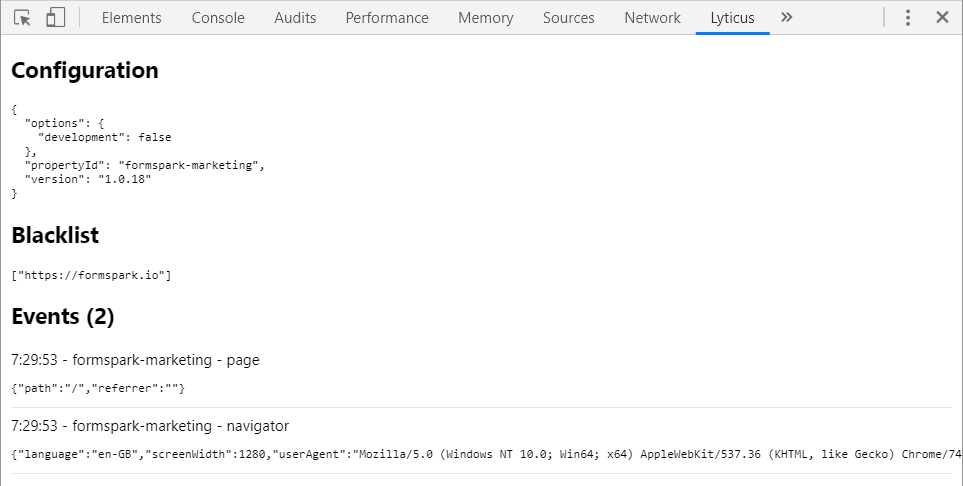

#  lyticus-devtools

## About

Browser devtools extension for [Lyticus](https://www.lyticus.com?ref=lyticus-devtools-github-about).

* Click the extension icon to disable your visits on your websites (invisible mode).
* Open the devtools panel to view your Lyticus configuration and events.

## License

[MIT](http://opensource.org/licenses/MIT)

## Links

* [Lyticus](https://www.lyticus.com?ref=lyticus-devtools-links)
* [Lyticus Documentation](https://documentation.lyticus.com?ref=lyticus-devtools-links)
* [Twitter](https://twitter.com/lyticus)
